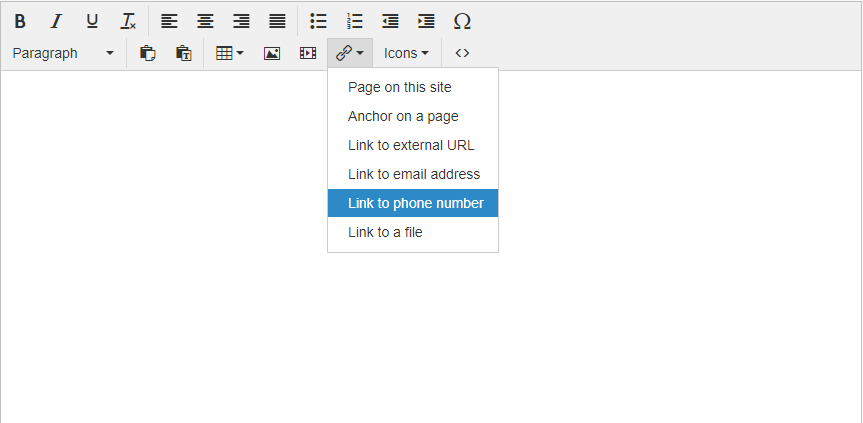
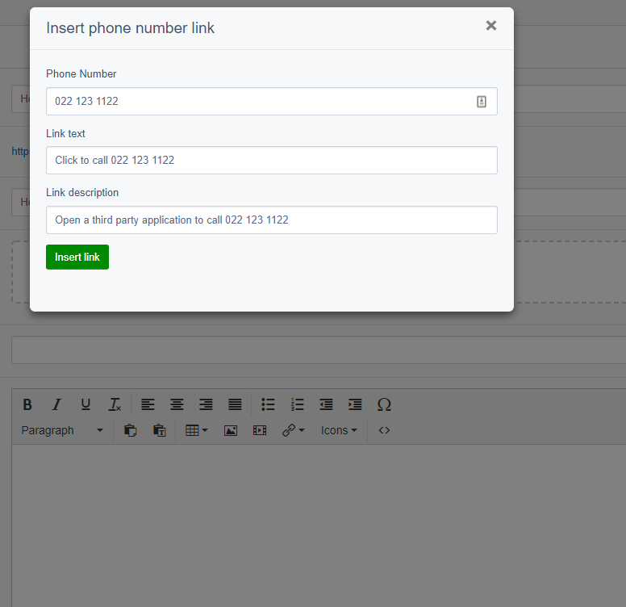
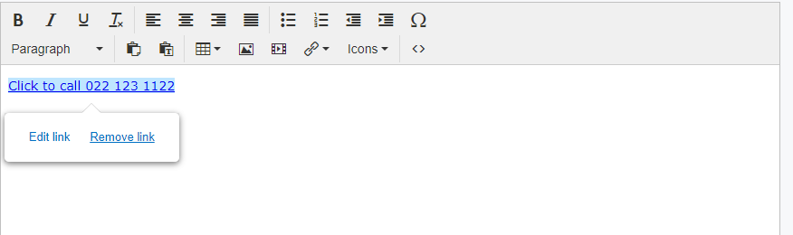

# SilverStripe 5 Phone Link Module 

Silverstripe 5 module adding the possibility to create / edit Phone number links using the TinyMCE editor (tel: links).

It uses the native SilverStripe 5 React modals and seamlessly integrates in the CMS.

If you need this for SilverStripe 4 use [2.1](https://github.com/firebrandhq/silverstripe-phonelink/tree/2.1.0).
If you need this for SilverStripe 3 [use Nathan Cox's module](https://github.com/nathancox/silverstripe-phonelink).

## Requirements

* [SilverStripe ^5.0](https://www.silverstripe.org/download)

For SilverStripe 4.4 use version 2.1.0

For SilverStripe 4.2 and 4.3 use version 2.0.3

For Silverstripe 4.0 to 4.1 use [this branch](https://github.com/firebrandhq/silverstripe-phonelink/tree/1.x)
## Installation

**Run the following command:**

```sh
composer require firebrandhq/silverstripe-phonelink "^2.0"
```

## Screenshots







## Translations

English and French are provided with the module.

## Contributing

[See CONTRIBUTING.md](CONTRIBUTING.md)

## Versioning

This library follows [Semver](http://semver.org). According to Semver, you will be able to upgrade to any minor or patch version of this library without any breaking changes to the public API. Semver also requires that we clearly define the public API for this library.

All methods, with `public` visibility, are part of the public API. All other methods are not part of the public API. Where possible, we'll try to keep `protected` methods backwards-compatible in minor/patch versions, but if you're overriding methods then please test your work before upgrading.

## Reporting Issues

Please [create an issue](https://github.com/firebrandhq/silverstripe-phonelink/issues) for any bugs you've found, or features you're missing.

  
